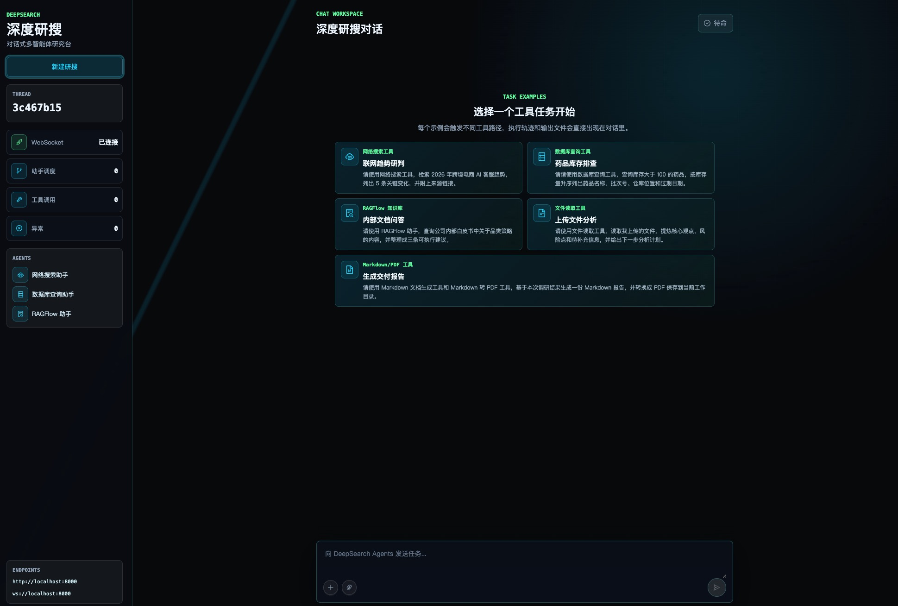
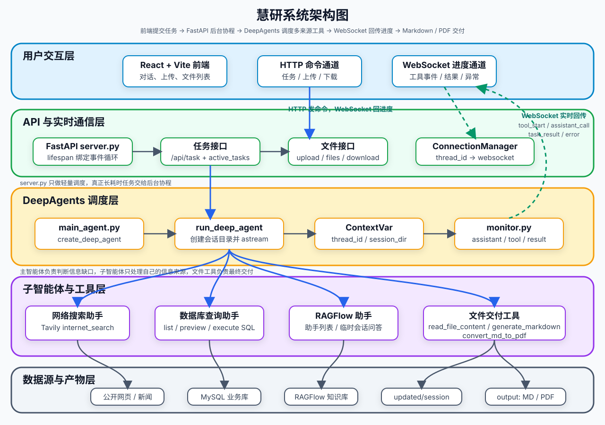
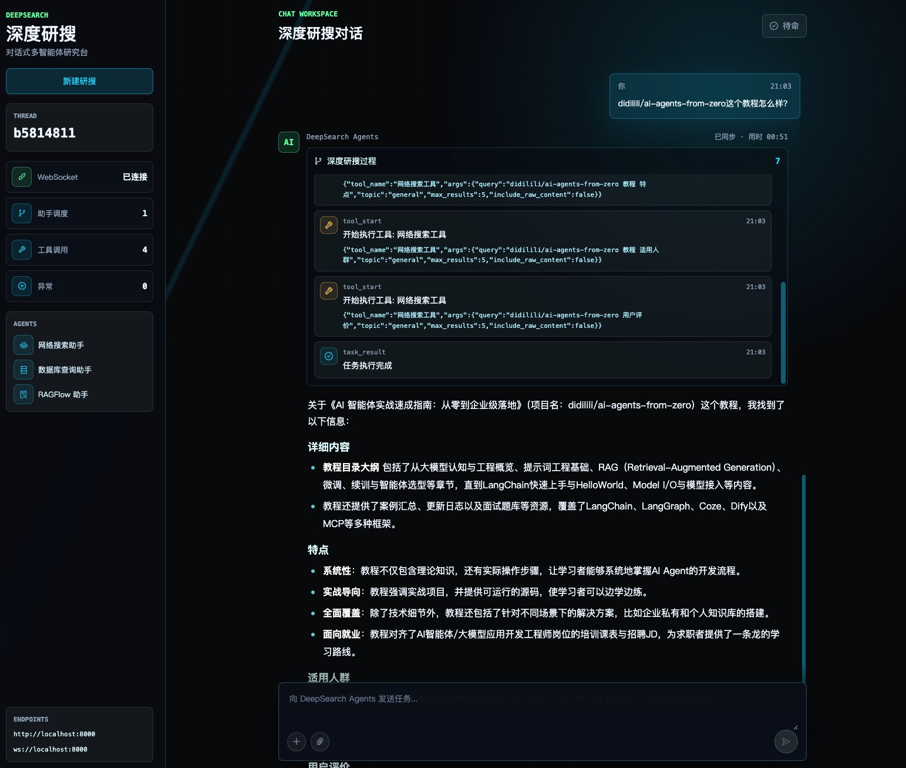
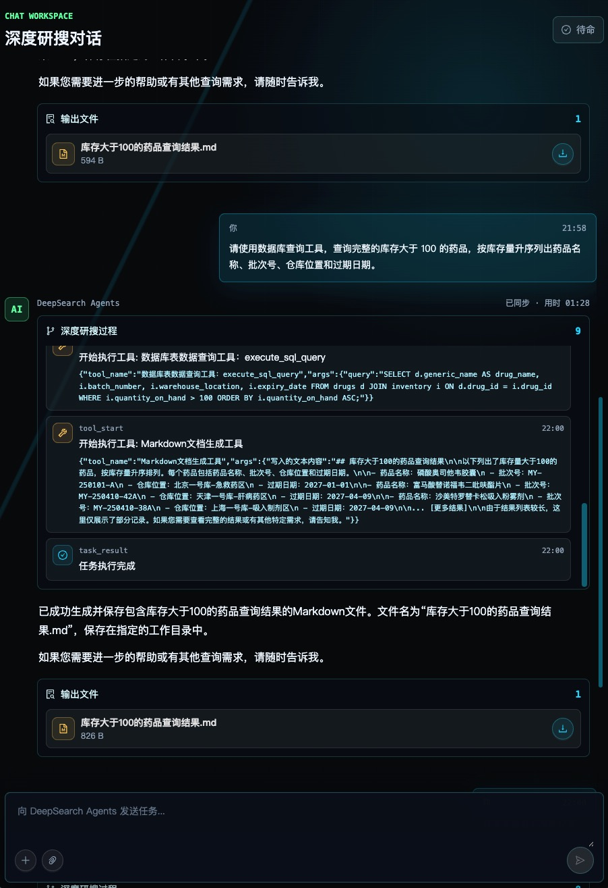

<div align='center'>
  <h1 style="margin-top: 15px;">「慧研」对话式多智能体深度研究系统</h1>
  <h4><b>insight-agents</b></h4>
  <p><em>基于 DeepAgents 构建的对话式多智能体研究助手：一主三从智能体调度，融合公开网络检索、结构化数据库查询与私有知识库问答，自动汇总多来源信息并交付 Markdown / PDF 研究报告</em></p>
</div>

<div align='center'>


</div>

「慧研」是一个可直接部署运行的对话式多智能体深度研究系统。用户提出一个研究任务，系统在后端自动完成信息来源判断、多路检索、附件读取、信息汇总与报告生成，并把完整的执行过程实时推送到前端。

它不是对大模型的单次调用，也不是套一个搜索 API 的问答演示。系统用 DeepAgents 组织主智能体与专家子智能体，根据任务需要查公开网络、查结构化数据库、查 RAGFlow 私有知识库、读取用户上传附件，在代码层面对工具调用、外部服务、报告引用做了工程化治理，最终把结果整理成回答、Markdown 或 PDF。



## 📖 项目介绍

在真实研究场景里，用户的问题经常不是一句普通问答可以解决的。

比如：

```text
结合公开资料、数据库信息和我上传的文档，整理一份机器人行业研究报告，并生成 PDF。
```

这个任务背后包含多类动作：

- 判断需要公开资料、内部数据、私有知识库还是本次上传文件；
- 去互联网搜索最新新闻、政策、产品或行业资料；
- 到 SQLite 数据库查询结构化业务数据；
- 到 RAGFlow 查询内部非结构化文档；
- 读取用户上传的 PDF、Word、Excel、Markdown 或文本文件；
- 汇总多来源信息，判断资料是否足够；
- 生成 Markdown 报告，校验引用完整性，并在需要时转换成 PDF；
- 把执行过程、最终结果和生成文件实时展示给前端，并支持历史会话回放。

用户只需要提出任务，系统会在后端组织一条可观察、可治理的多智能体执行链路：

```text
用户任务
  -> FastAPI 接口接收请求
  -> run_deep_agent 创建会话目录并写入上下文
  -> 主智能体分析任务
  -> 分派给网络搜索助手 / 数据库查询助手 / RAGFlow 助手
  -> 主智能体汇总多来源信息
  -> 调用文件工具生成 Markdown / PDF（交付前校验来源引用）
  -> monitor 通过 WebSocket 推送进度
  -> 前端展示事件、答案和文件列表
```

## ✨ 核心特性

- **一主三从的多智能体架构**
  - 主智能体负责理解任务、规划步骤、调度助手和最终汇总。
  - 网络搜索助手、数据库查询助手、RAGFlow 助手分别处理不同信息来源，上下文互相隔离。
- **多来源检索，而不是模型裸答**
  - `Tavily` 负责互联网公开资料检索。
  - `SQLite` 负责查询结构化业务数据。
  - `RAGFlow` 负责查询内部非结构化文档。
  - 上传附件由主智能体通过文件工具读取。
- **来源登记与引用完整性闸门**
  - 工具层自动登记每次任务实际收集到的网络链接、知识库文档与 SQL 查询记录，登记的是工具真实返回的原始来源，不经过模型转述。
  - 报告交付前由 `generate_markdown` 质量闸门校验引用：已收集网络来源但报告无链接时拒绝写入，并把来源清单喂回模型重写。
- **工具调用治理**
  - 任务级调用预算：按 `thread_id` 隔离，对每个工具强制最大调用次数（如 `internet_search` 上限 5 次），可用 `TOOL_BUDGET_JSON` 环境变量调参，拦截参数完全相同的重复调用。
  - 外部调用统一防护：超时控制、指数退避 + 随机抖动的有限重试、可重试/不可重试错误分类，避免一次外部抖动拖垮整个任务。
- **Token 用量统计**
  - 通过 LangChain 回调机制上报每一次模型调用的 Token 用量，覆盖主智能体与全部子智能体，随事件流实时推送到前端。
- **长任务执行过程可观察、可回放**
  - 工具调用、子智能体调用、Token 消耗、预算超限、工作目录创建、任务结果、取消和异常都会通过 `monitor` 推送到前端。
  - 每次任务的事件实时落盘到 `events.jsonl`，重启后可按会话回放恢复完整对话。
- **会话级上下文隔离**
  - 通过 `thread_id` 和 `session_dir` 区分不同任务，`ContextVar` 让深层工具也能拿到当前会话身份和文件目录。
- **从检索到交付的完整链路**
  - 真实调用工具、读取数据、生成 Markdown，并转换成 PDF；支持文件上传、产物列表、下载和在系统文件管理器中直接定位。

## 🏗️ 系统架构



项目采用 DeepAgents 中典型的 Orchestrator-Workers 模式：主智能体作为调度中心，三个专家助手负责信息获取，文件工具由主智能体直接掌握。

系统围绕两条主线展开：

| 主线             | 做什么                                                       | 涉及模块                                                                  |
| ---------------- | ------------------------------------------------------------ | ------------------------------------------------------------------------- |
| 多智能体深度研究 | 基于用户任务完成规划、分派、检索、读取附件、汇总和生成交付物 | `DeepAgents` / `LangChain` / `LangGraph` / `Tavily` / `SQLite` / `RAGFlow` |
| 前后端实时闭环   | 启动后台任务、上传文件、推送执行过程、展示结果和下载生成文件 | `FastAPI` / `WebSocket` / `React` / `Vite`                                |

### 智能体与工具

| 归属           | 能力                                     | 工具                                                          |
| -------------- | ---------------------------------------- | ------------------------------------------------------------- |
| 主智能体       | 任务规划、助手调度、结果汇总、文件交付   | `read_file_content`、`generate_markdown`、`convert_md_to_pdf` |
| 网络搜索助手   | 查询互联网公开信息、新闻、政策和网页资料 | `internet_search`                                             |
| 数据库查询助手 | 发现表名、预览表结构和样例数据、执行 SQL | `list_sql_tables`、`get_table_data`、`execute_sql_query`      |
| RAGFlow 助手   | 发现可用知识库助手，并向内部知识库提问   | `get_assistant_list`、`create_ask_delete`                     |





## 🛠️ 技术栈

| 模块           | 技术                                             | 作用                                                                          |
| -------------- | ------------------------------------------------ | ----------------------------------------------------------------------------- |
| 智能体框架     | `DeepAgents`                                     | 创建主智能体和子智能体，承接长任务、多工具、多助手调度                        |
| 图与检查点     | `LangGraph`                                      | 提供底层运行时和 `InMemorySaver` 会话检查点                                   |
| 模型与工具抽象 | `LangChain` / `langchain-core`                   | 封装 OpenAI 兼容模型、工具声明和 Agent 调用结构                               |
| 大模型接入     | OpenAI 兼容接口                                  | 通过 `.env` 中的 `OPENAI_BASE_URL`、`OPENAI_API_KEY`、`LLM_QWEN_MAX` 接入模型 |
| 网络搜索       | `Tavily`                                         | 为网络搜索助手提供公开资料检索                                                |
| 结构化数据     | `SQLite` / `sqlite3`（Python 标准库）            | 为数据库助手提供药品、库存、销售等业务示例数据                                |
| 私有知识库     | `RAGFlow` / `ragflow-sdk`                        | 为知识库助手提供内部文档问答能力                                              |
| 文件处理       | `pypdf` / `python-docx` / `pandas` / `ReportLab` | 读取上传附件，生成 Markdown，转换 PDF                                         |
| 后端接口       | `FastAPI` / `Uvicorn`                            | 提供任务、取消、上传、文件列表、下载和 WebSocket 接口                         |
| 实时通信       | `WebSocket`                                      | 推送工具调用、助手调用、Token 用量、最终结果和错误事件                        |
| 调用治理       | `call_guard` / `budget` / `source_registry`      | 超时重试与错误分类、任务级调用预算与去重、来源登记与引用闸门                  |
| 前端           | `React` / `Vite` / `Ant Design` / `Tailwind CSS` | 提供对话式研究界面、事件流、附件上传和文件下载                                |
| 依赖管理       | `uv` / `pnpm`                                    | 管理 Python 后端和前端依赖                                                    |

## 📁 项目结构

```text
insight-agents/
├── app/
│   ├── agent/
│   │   ├── subagents/              # 网络搜索、数据库查询、RAGFlow 三个子智能体
│   │   ├── llm.py                  # OpenAI 兼容模型初始化
│   │   ├── main_agent.py           # 主智能体组装与 run_deep_agent 执行入口
│   │   ├── prompts.py              # 读取 app/prompt/prompts.yml
│   │   └── usage_callback.py       # Token 用量回调，覆盖主/子智能体全部模型调用
│   ├── api/
│   │   ├── context.py              # ContextVar 保存 thread_id 和 session_dir
│   │   ├── monitor.py              # 工具调用、助手调用、用量、结果和异常事件推送
│   │   ├── budget.py               # 任务级工具调用预算与重复调用拦截
│   │   ├── source_registry.py      # 任务级来源登记表（网络/知识库/SQL）
│   │   └── server.py               # FastAPI 任务、上传、文件、下载、WebSocket 接口
│   ├── prompt/
│   │   └── prompts.yml             # 主智能体和子智能体提示词配置
│   ├── ragflow/                    # RAGFlow 配置和基础调用示例
│   ├── tools/                      # Tavily、SQLite、RAGFlow、文件读取、Markdown、PDF 工具
│   │   └── call_guard.py           # 外部调用统一防护：超时、重试、错误分类、埋点
│   ├── utils/                      # 路径解析、Markdown/PDF 底层转换等普通 Python 工具
│   ├── output/                     # 运行时生成：每个会话的 Markdown、PDF、events.jsonl 等产物
│   └── updated/                    # 运行时生成：用户上传文件的会话暂存目录
├── app/data/
│   ├── init_sqlite.sql             # SQLite 建库脚本：药品、库存、销售记录业务示例数据
│   └── deepsearch.db               # 运行时生成：SQLite 数据库文件（已 gitignore）
├── docs/knowledge_base/            # RAGFlow 知识库示例 PDF
├── examples/                       # DeepAgents 框架能力验证脚本
├── frontend/                       # React + Vite 前端项目
├── tests/                          # 测试目录
├── .env.example                    # 环境变量示例
├── pyproject.toml                  # Python 项目依赖声明
├── requirements.txt                # 依赖清单
└── uv.lock                         # uv 锁定文件
```

## 🚀 快速开始

### 1. 准备环境

- Python `3.12`
- `uv`（或 conda + `requirements.txt`）
- Node.js 与 `pnpm`
- 可用的大模型 API Key
- Tavily API Key
- RAGFlow 服务与 API Key（可选）

### 2. 克隆项目

```bash
git clone https://github.com/fudehui/insight-agents.git
cd insight-agents
```

### 3. 安装后端依赖

```bash
uv sync
```

### 4. 配置环境变量

```bash
cp .env.example .env
```

按本机实际服务和密钥修改 `.env`：

```bash
# LLM 配置
OPENAI_BASE_URL=https://dashscope.aliyuncs.com/compatible-mode/v1
OPENAI_API_KEY=你的大模型_API_KEY
LLM_QWEN_MAX=qwen-max

# Tavily 配置
TAVILY_API_KEY=你的_TAVILY_API_KEY

# RAGFlow 配置
RAGFLOW_API_URL=http://your-ragflow-host
RAGFLOW_API_KEY=ragflow-your-api-key

# SQLite 配置
# 单文件数据库，无需安装服务或 Docker；不配置时默认使用 app/data/deepsearch.db
SQLITE_DB_PATH=app/data/deepsearch.db

# 可选：工具调用预算覆盖（JSON 格式，未配置时使用内置默认限额）
# TOOL_BUDGET_JSON={"internet_search": 3}
```

### 5. 初始化 SQLite 数据库

数据库使用 Python 标准库 `sqlite3` 的单文件方案，无需安装任何服务或 Docker。**通常无需手动初始化**：后端首次连接数据库时会自动执行 `app/data/init_sqlite.sql`，在 `app/data/deepsearch.db` 中建表并导入药品、库存、销售记录业务示例数据。

如需手动建库（例如提前把库文件放到其他位置）：

```bash
python -c "import sqlite3; sqlite3.connect('app/data/deepsearch.db').executescript(open('app/data/init_sqlite.sql', encoding='utf-8').read())"
```

删除 `app/data/deepsearch.db` 文件后重新运行，即可将数据恢复到初始状态。

### 6. 准备 RAGFlow 知识库

RAGFlow 需要接入你已有的 RAGFlow 服务。仓库内的 `docs/knowledge_base/` 提供了电商、金融等示例 PDF，可用于创建 RAGFlow 知识库和聊天助手。

如果暂时不使用私有知识库能力，也可以先运行网络搜索、数据库查询和上传文件读取链路；只有任务触发 RAGFlow 助手时才会依赖 `RAGFLOW_API_URL` 和 `RAGFLOW_API_KEY`。

### 7. 启动后端

```bash
uv run uvicorn app.api.server:app --host 127.0.0.1 --port 8000 --reload
```

后端接口：

| 接口                                   | 说明                                   |
| -------------------------------------- | -------------------------------------- |
| `POST /api/task`                       | 启动一次 DeepAgents 后台任务           |
| `POST /api/task/{thread_id}/cancel`    | 取消指定会话任务                       |
| `POST /api/upload`                     | 上传一个或多个文件到当前会话           |
| `GET /api/files`                       | 列出当前会话输出目录中的生成文件       |
| `GET /api/download`                    | 下载输出目录中的文件                   |
| `POST /api/files/reveal`               | 在系统文件管理器中打开并选中产物文件   |
| `GET /api/sessions`                    | 列出历史会话（标题、时间、文件数）     |
| `GET /api/sessions/{thread_id}/events` | 回放指定会话的历史事件，前端据此恢复对话 |
| `DELETE /api/sessions/{thread_id}`     | 删除指定历史会话及其事件与产物         |
| `WebSocket /ws/{thread_id}`            | 推送工具调用、助手调用、结果和异常事件 |

会话历史说明：每次任务的事件会实时落盘到 `app/output/session_{thread_id}/events.jsonl`。
前端重启后侧边栏可看到历史会话列表，点击即可回放恢复完整对话；重连时服务端会自动补发
`session_created` 事件以恢复文件面板。

### 8. 启动前端

```bash
cd frontend
pnpm install
pnpm dev
```

前端默认连接：

```text
API: http://localhost:8000
WS:  ws://localhost:8000
```

如需修改，可以在 `frontend/.env.local` 中配置：

```bash
VITE_API_BASE_URL=http://localhost:8000
VITE_WS_BASE_URL=ws://localhost:8000
```

### 9. 试几个任务

```text
从数据库中查询心血管药品的库存情况，并生成 Markdown 报告。
```

```text
搜索 2026 年 AI 在电商行业的应用趋势，并结合知识库资料生成一份 PDF。
```

```text
请先读取我上传的行业报告，再结合公开资料整理一份研究摘要。
```

## 🎯 适用场景

- 行业与竞品调研：结合公开网络资料与内部数据，产出可交付的研究报告。
- 企业内部知识问答：将私有知识库、业务数据库与上传文档纳入同一次任务执行。
- 报告自动化：从检索、汇总到 Markdown / PDF 交付的全流程自动化，附完整来源引用。
- 多智能体工程参考：一主三从调度、工具治理、事件推送与会话回放的完整实现，可作为同类系统的架构与代码基础进行二次开发。

## 🚧 能力边界与后续规划

当前版本重点覆盖多智能体调度、真实工具接入、调用治理、文件交付、FastAPI 接口、WebSocket 实时推送和前后端闭环，可以直接部署使用。以下生产治理能力尚未展开，可作为后续扩展方向：

- 用户登录、角色权限和多租户隔离；
- 文件上传安全扫描和内容审核；
- 任务队列、分布式执行和大规模并发治理；
- 全量事件持久化到外部存储、审计追踪；
- 系统化评测集、自动化回归和 Agent 质量评估；
- 生产监控、告警、链路追踪和灰度发布；
- 复杂报告编辑、协同工作流和权限化文件管理。
