<div align='center'>
  <h1 style="margin-top: 15px;">「慧研」对话式多智能体深度研究系统</h1>
  <h4><b>insight-agents</b></h4>
  <p><em>基于 DeepAgents 构建的对话式多智能体深度研究系统：一主四从智能体调度，融合公开网络检索、结构化数据库查询、私有知识库问答与沙箱定量计算，自动汇总多来源信息并交付带引用溯源、可内嵌交互图表的 Markdown / PDF 研究报告</em></p>
</div>

<div align='center'>


</div>

「慧研」是一个可直接部署运行的对话式多智能体深度研究系统。用户提出一个研究任务，系统在后端自动完成信息来源判断、多路检索、附件读取、信息汇总与报告生成，并把完整的执行过程实时推送到前端。

它不是对大模型的单次调用，也不是套一个搜索 API 的问答演示。系统用 DeepAgents 组织主智能体与专家子智能体，根据任务需要查公开网络、查结构化数据库、查 RAGFlow 私有知识库、读取用户上传附件，在代码层面对工具调用、外部服务、报告引用做了工程化治理，最终把结果整理成回答、Markdown 或 PDF。

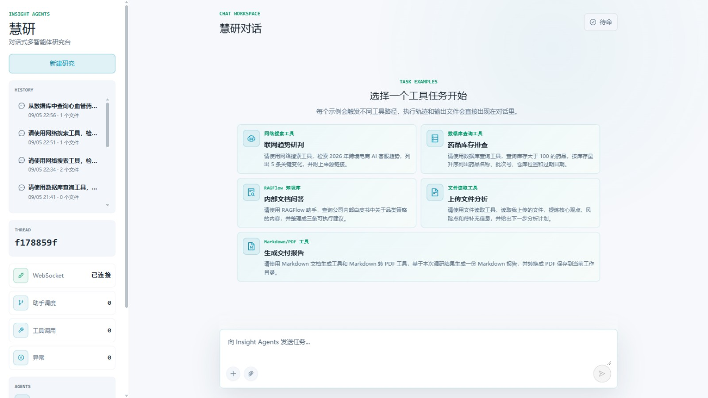

## 📖 项目介绍

在真实研究场景里，用户的问题经常不是一句普通问答可以解决的。

比如：

```text
结合公开资料、数据库信息和我上传的文档，整理一份机器人行业研究报告，并生成 PDF。
```

这个任务背后包含多类动作：

- 判断需要公开资料、内部数据、私有知识库还是本次上传文件；
- 去互联网搜索最新新闻、政策、产品或行业资料；
- 到 SQLite 数据库查询结构化业务数据；
- 到 RAGFlow 查询内部非结构化文档；
- 读取用户上传的 PDF、Word、Excel、Markdown 或文本文件；
- 把检索与查询结果交给 Docker 沙箱做定量计算（同比/环比、占比、聚合），生成图表；
- 汇总多来源信息，判断资料是否足够；
- 生成 Markdown 报告（可内嵌交互式图表），校验引用完整性，并在需要时转换成 PDF；
- 把执行过程、最终结果和生成文件实时展示给前端，并支持历史会话回放；
- 用户对报告的修订可沉淀为跨会话长期记忆，同类任务自动召回作为先验。

用户只需要提出任务，系统会在后端组织一条可观察、可治理的多智能体执行链路：

```text
用户任务
  -> FastAPI 接口接收请求
  -> run_deep_agent 创建会话目录并写入上下文（同时召回跨会话记忆先验）
  -> 主智能体分析任务
  -> 分派给网络搜索助手 / 数据库查询助手 / RAGFlow 助手 / 数据分析助手
  -> 数据分析助手在 Docker 沙箱中执行 Python 完成定量计算与图表
  -> 主智能体汇总多来源信息
  -> 调用文件工具生成 Markdown / PDF（交付前校验来源引用，可内嵌交互图表）
  -> monitor 通过 WebSocket 推送进度
  -> 前端展示事件、答案和文件列表；报告修订可回流长期记忆
```

## ✨ 核心特性

- **一主四从的多智能体架构**
  - 主智能体负责理解任务、规划步骤、调度助手和最终汇总。
  - 网络搜索助手、数据库查询助手、RAGFlow 助手、数据分析助手分别处理不同信息来源，上下文互相隔离。
- **多来源检索，而不是模型裸答**
  - `Tavily` 负责互联网公开资料检索。
  - `SQLite` 负责查询结构化业务数据。
  - `RAGFlow` 负责查询内部非结构化文档。
  - 上传附件由主智能体通过文件工具读取。
- **来源登记与引用完整性闸门**
  - 工具层自动登记每次任务实际收集到的网络链接、知识库文档与 SQL 查询记录，登记的是工具真实返回的原始来源，不经过模型转述。
  - 报告交付前由 `generate_markdown` 质量闸门校验引用：已收集网络来源但报告无链接时拒绝写入，并把来源清单喂回模型重写。
- **Docker 沙箱定量计算（只能查 → 能算）**
  - 数据分析助手把模型生成的 Python 代码写入会话目录，在一次性加固容器中执行：网络隔离（`--network=none`）、内存/CPU/进程数限额、只读 rootfs、非 root 运行、双层超时、磁盘防护，stdout 与产物文件返回给模型。
  - 预装 pandas / matplotlib 与 Noto CJK 中文字体：同比环比、占比、聚合统计与 PNG 图表在沙箱内精确计算，中文标签正常渲染，报告数值不靠模型心算。
  - 产物统一收口到会话目录 `sandbox/` 子目录并自动进入产物面板。

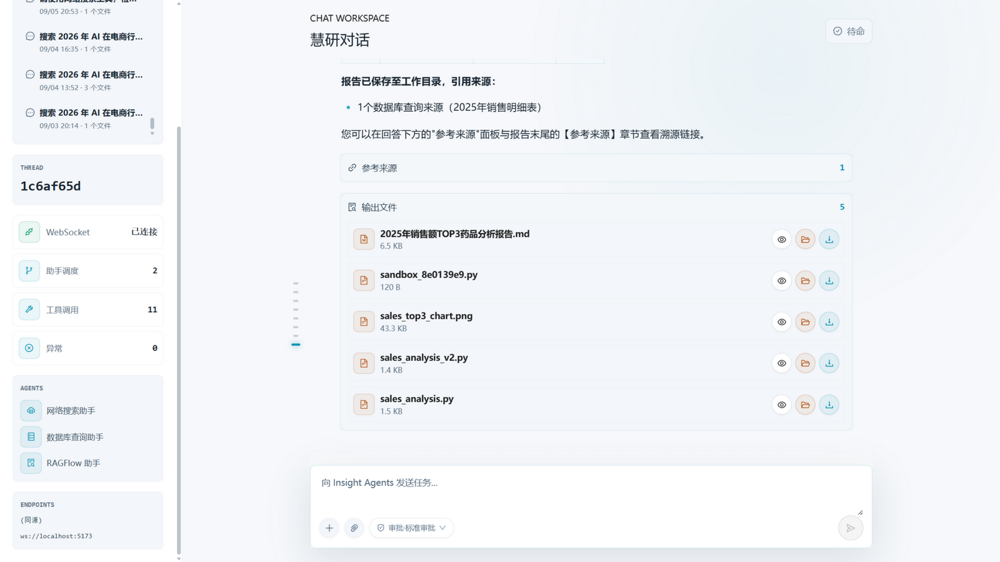

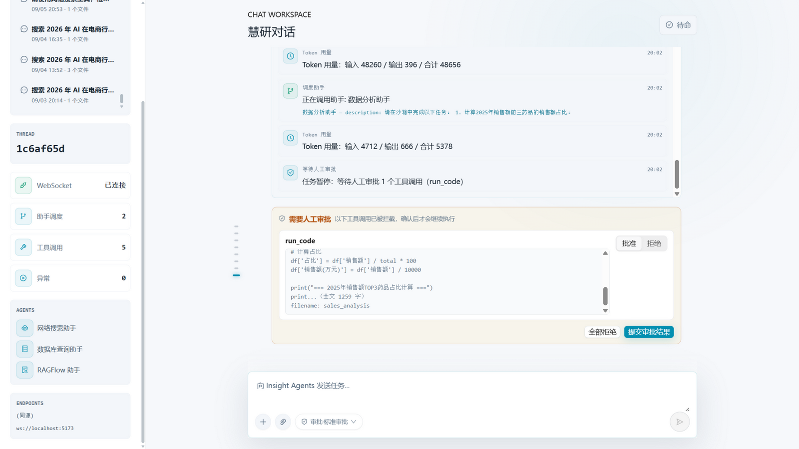
- **报告内嵌交互式图表（ECharts）**
  - `generate_chart` 只接受纯 JSON option（禁止函数/脚本字符串、限制大小），校验通过后以 ` ```echarts ` 围栏嵌入报告，前端渲染成交互图表，解析失败自动降级为普通代码块。
  - PDF 链路为纯 ReportLab 无浏览器内核，交互图表在 PDF 中降级为占位说明，需要静态图时改用沙箱 matplotlib 产出。

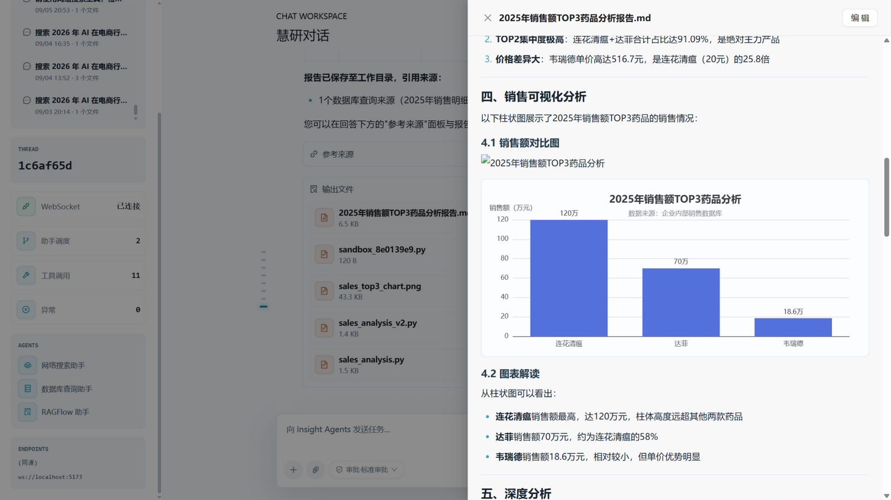
- **Token 预算治理**
  - `TokenBudgetMiddleware` 按会话累计模型调用 token（随 checkpoint 持久化），超限（默认 150 万，`TOKEN_BUDGET` 可调）跳转图末尾强制收尾并说明原因；与内置上下文摘要压缩组成双层治理。
- **跨会话长期记忆与修订反馈闭环**
  - 报告支持应用内编辑：保存修订（乐观锁防与任务收尾互踩）后暂存为待沉淀记忆，下次同类任务召回修订内容作为先验，模型经 `memory_write` 走正常审批流入库。
  - 记忆安全：入库前敏感信息扫描（手机号/身份证/邮箱/疑似密钥命中即拒绝）、净化限长、注入先验以非指令数据块包裹且不参与治理决策；记忆可按会话删除。
  - 自研 SQLite 向量 Store（sqlite-vec 向量召回），与对话 checkpoint 分离存储。

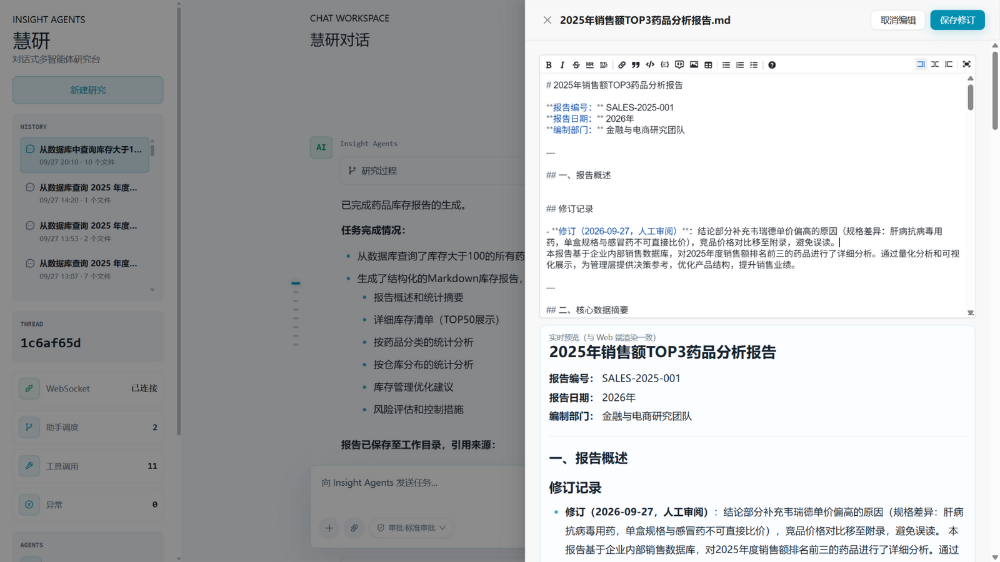

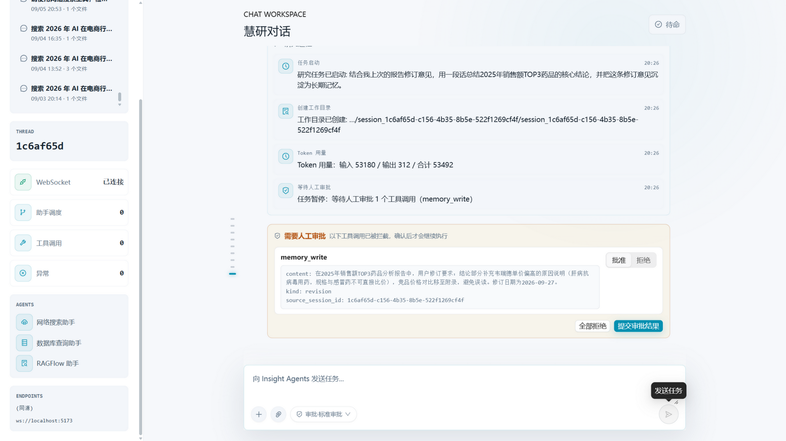
- **标准 MCP Server 对外暴露工具**
  - 内部工具经 FastMCP 封装为标准 MCP Server：SSE in-process 挂载（`/mcp`，强制 Bearer 令牌鉴权，未配置令牌拒绝启动）+ stdio 本地调试模式。
  - 最小暴露白名单：默认仅 `internet_search` 与 SQLite 三件套共 4 个工具；MCP 来源调用走独立配额并打 `caller=mcp` 审计标记；`langchain-mcp-adapters` 跨宿主互操作已验证，Claude Code 等外部 Agent 可直接调用（详见 `docs/mcp.md`）。
- **工具调用治理**
  - 任务级调用预算：按 `thread_id` 隔离，对每个工具强制最大调用次数（如 `internet_search` 上限 5 次），可用 `TOOL_BUDGET_JSON` 环境变量调参，拦截参数完全相同的重复调用。
  - 外部调用统一防护：超时控制、指数退避 + 随机抖动的有限重试、可重试/不可重试错误分类，避免一次外部抖动拖垮整个任务。
- **Token 用量统计**
  - 通过 LangChain 回调机制上报每一次模型调用的 Token 用量，覆盖主智能体与全部子智能体，随事件流实时推送到前端。
- **Langfuse 全链路 tracing（可选）**
  - 配置 `LANGFUSE_PUBLIC_KEY` / `LANGFUSE_SECRET_KEY` / `LANGFUSE_HOST` 三项后，Langfuse CallbackHandler 随 `RunnableConfig` 穿透子智能体，主 + 子全部模型调用上报 trace，可用于定位 P95 瓶颈与成本分布。
  - 零配置零开销旁路：任一密钥缺失时完全不加载 langfuse 依赖；观测组件构造异常只打 warning，绝不阻塞任务执行。
- **长任务执行过程可观察、可回放**
  - 工具调用、子智能体调用、Token 消耗、预算超限、工作目录创建、任务结果、取消和异常都会通过 `monitor` 推送到前端。
  - 每次任务的事件实时落盘到 `events.jsonl`，重启后可按会话回放恢复完整对话。

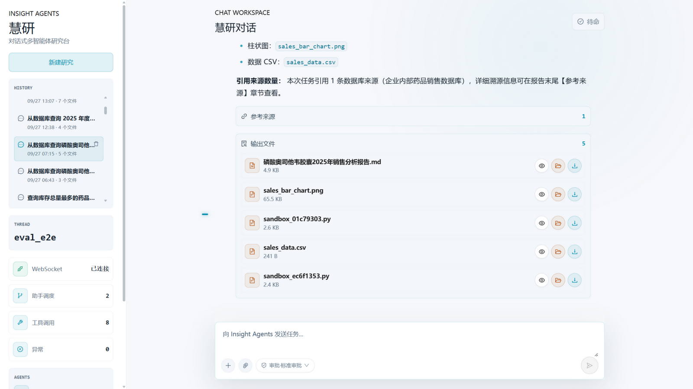

- **最终回答流式输出**
  - 主模型生成的回答以增量文本实时推送到前端，长报告边生成边显示；权威完整结果随 `task_result` 到达后覆盖，流式增量不落盘，回放仍以完整结果恢复。
- **连接健壮性**
  - WebSocket 断线按指数退避 + 随机抖动自动重连；心跳超时主动断开半开连接；重连成功后自动回放会话事件对账，断线窗口内丢失的事件按事件序号去重补齐。
- **应用内预览与回答交互**
  - 产物卡片支持应用内预览（Markdown 渲染 / PDF / 图片内联展示）、一键下载、在文件管理器中定位；最终回答一键复制，失败的任务可一键重试。
- **人机协同审批（Human-in-the-loop）**
  - 高危工具执行前任务自动暂停，前端弹出审批卡片展示待审动作与参数摘要；逐项批准/拒绝后任务恢复执行，拒绝的工具会把结果告知模型并由其收尾。
  - **三档审批档位可在输入框工具栏随时切换，对下一个任务生效**：关闭审批（工具直接执行）、标准审批（默认，文件交付前确认）、严格审批（文件、SQL 查询、网络搜索、知识库提问均需确认，含子智能体内部的工具调用）。
  - 拦截范围也可用 `HITL_APPROVAL_TOOLS` 环境变量作为服务端缺省（前端未传档位时生效，设为空关闭）；审批状态随检查点持久化，后端重启后仍可审批；运行中刷新页面也能恢复"等待确认"态。

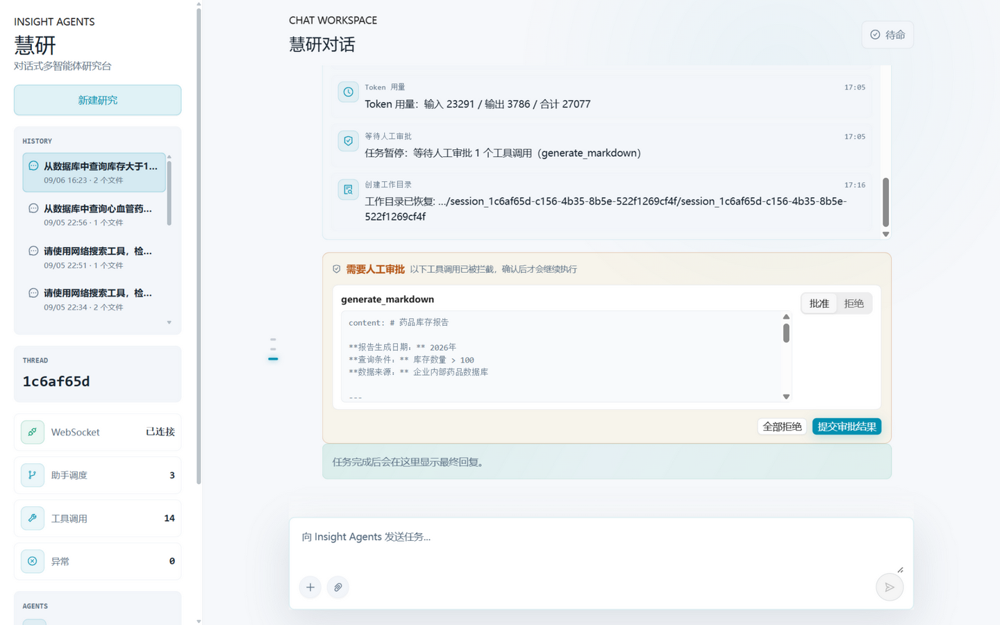

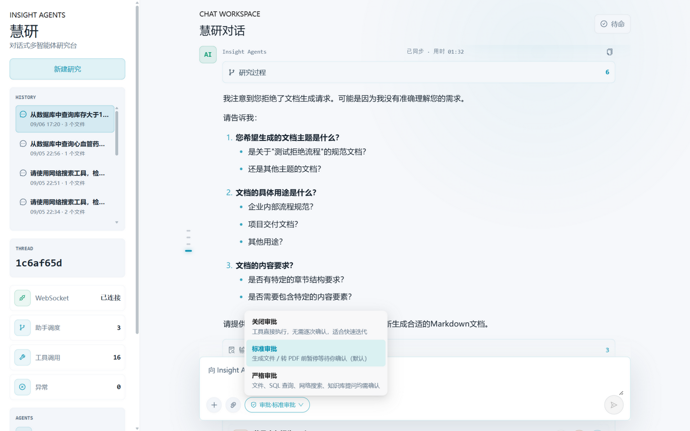

- **访问令牌鉴权（可选）**
  - 配置 `APP_ACCESS_TOKEN` 后所有 REST 接口与 WebSocket 都需要携带令牌（请求头优先、查询参数兜底）；前端首次访问弹窗输入一次并保存在浏览器。不配置则不做任何鉴权，本地开发零负担。

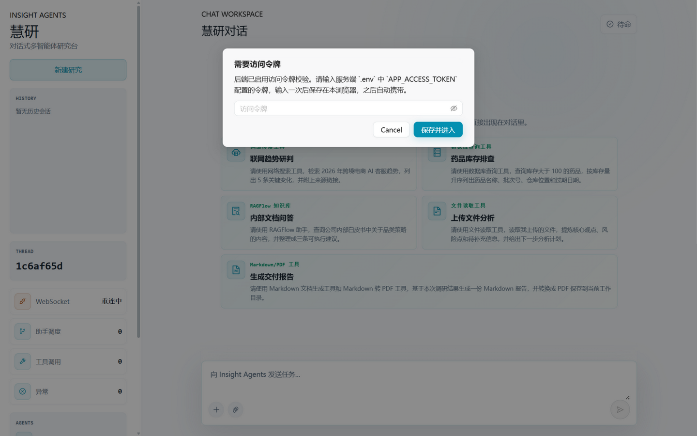
- **会话记忆持久化，重启不丢上下文**
  - 对话检查点通过 `AsyncSqliteSaver` 落盘到 `app/data/checkpoints.db`，同一会话多次提问共享上下文，后端重启（含 `--reload` 改码触发）后追问仍记得前文。
  - 删除会话时会同步清理对应 checkpoint，避免复用同一 `thread_id` 时旧上下文"复活"。
- **上下文与安全防护**
  - 大文件分段读取：`read_file_content` 单次最多返回约 3 万字符（`FILE_READ_MAX_CHARS` 可调），超限截断并附续读提示，模型可用 `offset` 参数分段读取。
  - SQL 表名白名单：`get_table_data` 先对 `sqlite_master` 做参数化校验再以引号包裹执行，并统一走只读连接，防提示词注入拼接危险 SQL。
  - 上传双重校验：前后端一致的类型白名单（md/txt/docx/pdf/xlsx/xls/csv）、单文件 50MB、单次 10 个，超限请求直接拒绝并清理半成品文件。
- **会话级上下文隔离**
  - 通过 `thread_id` 和 `session_dir` 区分不同任务，`ContextVar` 让深层工具也能拿到当前会话身份和文件目录。
- **从检索到交付的完整链路**
  - 真实调用工具、读取数据、生成 Markdown，并转换成 PDF；支持文件上传、产物列表、应用内预览、下载和在系统文件管理器中直接定位。

## 🏗️ 系统架构

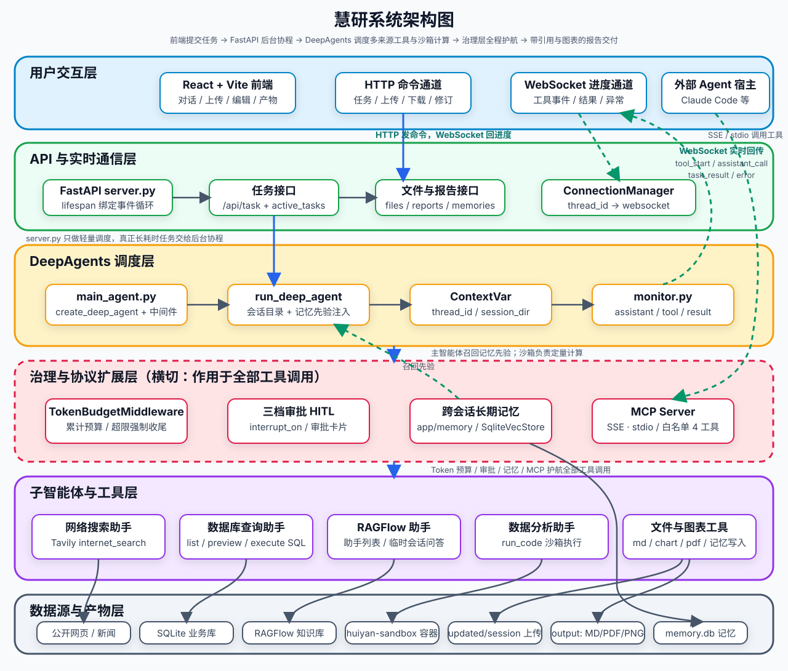

项目采用 DeepAgents 中典型的 Orchestrator-Workers 模式：主智能体作为调度中心，四个专家助手负责信息获取与定量计算，文件工具由主智能体直接掌握。

系统围绕两条主线展开：

| 主线             | 做什么                                                       | 涉及模块                                                                  |
| ---------------- | ------------------------------------------------------------ | ------------------------------------------------------------------------- |
| 多智能体深度研究 | 基于用户任务完成规划、分派、检索、读取附件、沙箱计算、汇总和生成交付物 | `DeepAgents` / `LangChain` / `LangGraph` / `Tavily` / `SQLite` / `RAGFlow` |
| 治理与协议扩展   | Token 预算、三档审批、跨会话记忆与先验注入、MCP 对外暴露工具、可选全链路 tracing | `token_budget_middleware` / `interrupt_on` / `app/memory` / `FastMCP` / `app/observability`      |
| 前后端实时闭环   | 启动后台任务、上传文件、推送执行过程、展示结果和下载生成文件 | `FastAPI` / `WebSocket` / `React` / `Vite`                                |

### 智能体与工具

| 归属           | 能力                                     | 工具                                                          |
| -------------- | ---------------------------------------- | ------------------------------------------------------------- |
| 主智能体       | 任务规划、助手调度、结果汇总、文件交付、图表与记忆 | `read_file_content`、`generate_markdown`、`generate_chart`、`convert_md_to_pdf`、`memory_write` |
| 网络搜索助手   | 查询互联网公开信息、新闻、政策和网页资料 | `internet_search`                                             |
| 数据库查询助手 | 发现表名、预览表结构和样例数据、执行 SQL | `list_sql_tables`、`get_table_data`、`execute_sql_query`      |
| RAGFlow 助手   | 发现可用知识库助手，并向内部知识库提问   | `get_assistant_list`、`create_ask_delete`                     |
| 数据分析助手   | 在 Docker 沙箱中执行 Python，完成定量分析与图表生成 | `run_code`                                            |

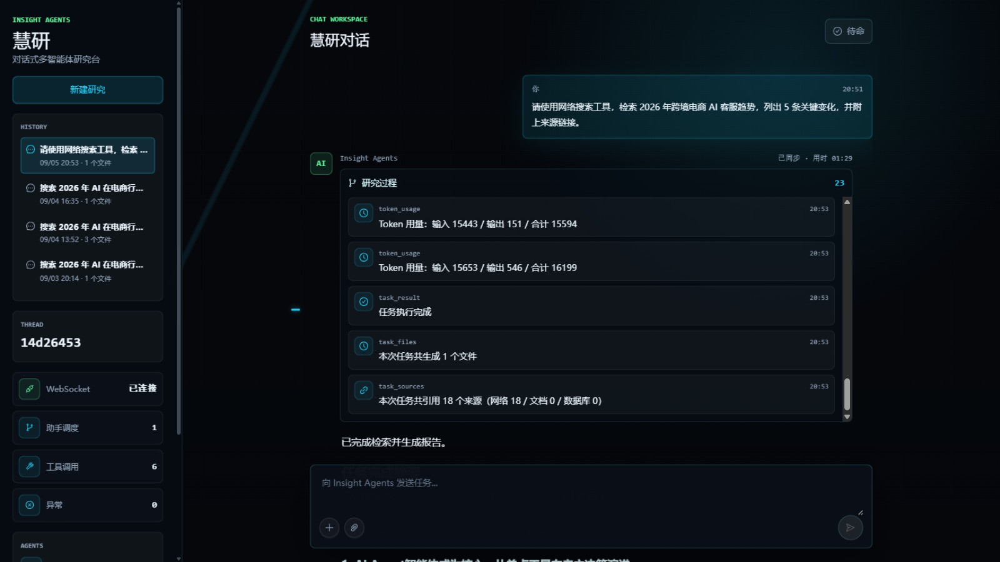

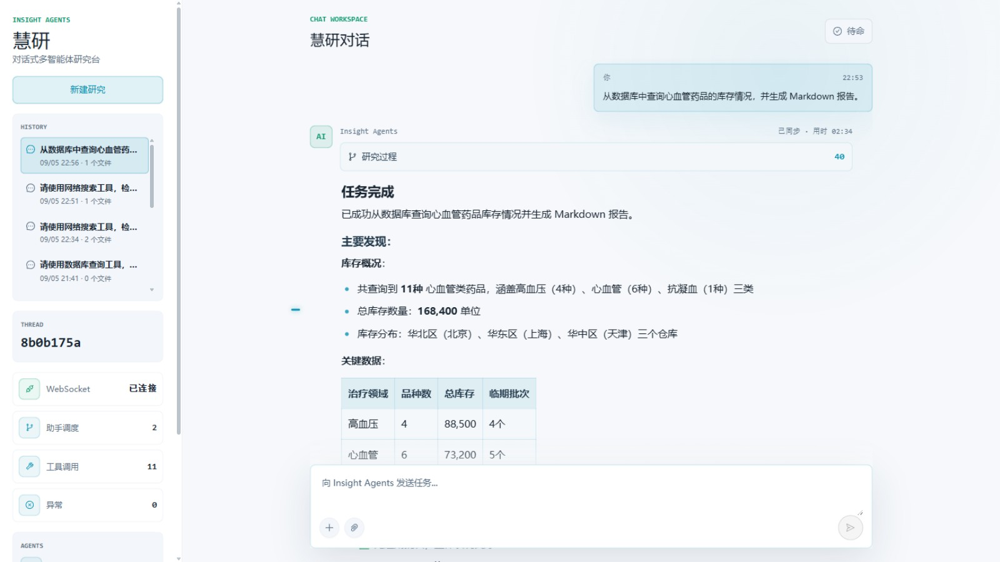

## 🛠️ 技术栈

| 模块           | 技术                                             | 作用                                                                          |
| -------------- | ------------------------------------------------ | ----------------------------------------------------------------------------- |
| 智能体框架     | `DeepAgents`                                     | 创建主智能体和子智能体，承接长任务、多工具、多助手调度                        |
| 图与检查点     | `LangGraph`                                      | 提供底层运行时和 `AsyncSqliteSaver` 会话检查点（对话记忆持久化到 SQLite）     |
| 模型与工具抽象 | `LangChain` / `langchain-core`                   | 封装 OpenAI 兼容模型、工具声明和 Agent 调用结构                               |
| 大模型接入     | OpenAI 兼容接口                                  | 通过 `.env` 中的 `OPENAI_BASE_URL`、`OPENAI_API_KEY`、`LLM_QWEN_MAX` 接入模型 |
| 网络搜索       | `Tavily`                                         | 为网络搜索助手提供公开资料检索                                                |
| 结构化数据     | `SQLite` / `sqlite3`（Python 标准库）            | 为数据库助手提供药品、库存、销售等业务示例数据                                |
| 私有知识库     | `RAGFlow` / `ragflow-sdk`                        | 为知识库助手提供内部文档问答能力                                              |
| 文件处理       | `pypdf` / `python-docx` / `pandas` / `ReportLab` | 读取上传附件，生成 Markdown，转换 PDF                                         |
| 后端接口       | `FastAPI` / `Uvicorn`                            | 提供任务、取消、上传、文件列表、下载和 WebSocket 接口                         |
| 实时通信       | `WebSocket`                                      | 推送工具调用、助手调用、Token 用量、最终结果和错误事件                        |
| 调用治理       | `call_guard` / `budget` / `source_registry`      | 超时重试与错误分类、任务级调用预算与去重、来源登记与引用闸门                  |
| 定量沙箱       | `Docker` / `sqlite-vec`                          | 加固容器执行模型生成的 Python（pandas/matplotlib）；sqlite-vec 支撑跨会话记忆向量召回 |
| 协议开放       | `FastMCP` / `langchain-mcp-adapters`             | 内部工具封装为标准 MCP Server（SSE/stdio），外部 Agent 宿主互操作             |
| 可选观测       | `Langfuse`                                       | 模型调用全链路 tracing（密钥齐备自动启用，缺失零开销旁路）                    |
| 前端           | `React` / `Vite` / `Ant Design` / `echarts` / `@uiw/react-md-editor` | 提供对话式研究界面、事件流、交互图表渲染与报告编辑态     |
| 依赖管理       | `uv` / `pnpm`                                    | 管理 Python 后端和前端依赖                                                    |

## 📁 项目结构

```text
insight-agents/
├── app/
│   ├── agent/
│   │   ├── subagents/              # 网络搜索、数据库查询、RAGFlow、数据分析四个子智能体
│   │   ├── llm.py                  # OpenAI 兼容模型初始化
│   │   ├── main_agent.py           # 主智能体组装与 run_deep_agent 执行入口
│   │   ├── prompts.py              # 读取 app/prompt/prompts.yml
│   │   ├── token_budget_middleware.py  # Token 预算中间件：累计超限强制收尾
│   │   └── usage_callback.py       # Token 用量回调，覆盖主/子智能体全部模型调用
│   ├── api/
│   │   ├── context.py              # ContextVar 保存 thread_id 和 session_dir
│   │   ├── monitor.py              # 工具调用、助手调用、用量、结果和异常事件推送
│   │   ├── budget.py               # 任务级工具调用预算、重复拦截与 MCP 独立配额
│   │   ├── source_registry.py      # 任务级来源登记表（网络/知识库/SQL）
│   │   └── server.py               # FastAPI 任务、上传、文件、下载、报告修订、记忆删除、WebSocket 接口
│   ├── memory/                     # 跨会话长期记忆（P0-3）：自研向量 Store、安全层、先验注入
│   ├── mcp_server.py               # MCP Server：白名单工具暴露、SSE/stdio、Bearer 鉴权
│   ├── observability/              # Langfuse 可选观测：回调挂载、零配置零开销旁路
│   ├── prompt/
│   │   └── prompts.yml             # 主智能体和子智能体提示词配置
│   ├── ragflow/                    # RAGFlow 配置和基础调用示例
│   ├── tools/                      # Tavily、SQLite、RAGFlow、沙箱、图表、记忆、文件读取、Markdown、PDF 工具
│   │   ├── call_guard.py           # 外部调用统一防护：超时、重试、错误分类、埋点
│   │   └── sandbox_tools.py        # run_code：加固 Docker 容器执行模型生成的 Python
│   ├── utils/                      # 路径解析、Markdown/PDF 底层转换等普通 Python 工具
│   ├── output/                     # 运行时生成：每个会话的 Markdown、PDF、events.jsonl 等产物
│   └── updated/                    # 运行时生成：用户上传文件的会话暂存目录
├── app/data/
│   ├── init_sqlite.sql             # SQLite 建库脚本：药品、库存、销售记录业务示例数据
│   ├── deepsearch.db               # 运行时生成：SQLite 业务数据库文件（已 gitignore）
│   ├── checkpoints.db              # 运行时生成：会话对话记忆检查点文件（已 gitignore）
│   └── memory.db                   # 运行时生成：跨会话长期记忆与待沉淀修订（已 gitignore）
├── docs/                           # 专项文档：memory.md（记忆）、mcp.md（MCP 接入）、知识库示例
├── evals/                          # 评测流水线：42 条 golden case、评分三件套、故障注入、基线报告
├── examples/                       # DeepAgents 框架能力验证脚本
├── frontend/                       # React + Vite 前端项目（echarts 交互图表、报告编辑态）
│   ├── Dockerfile                  # 前端镜像：Vite 构建产物由 nginx 托管
│   └── nginx.conf                  # nginx 同源反代 /api 与 /ws
├── tests/                          # 34 个测试文件、333 个用例
├── Dockerfile                      # 后端镜像：uv 按 uv.lock 安装依赖
├── Dockerfile.sandbox              # 沙箱镜像：huiyan-sandbox（预装 pandas/matplotlib）
├── docker-compose.yml              # 双容器编排：nginx 前端 + FastAPI 后端
├── .dockerignore                   # Docker 构建上下文排除清单
├── .env.example                    # 环境变量示例
├── pyproject.toml                  # Python 项目依赖声明
├── requirements.txt                # 依赖清单
└── uv.lock                         # uv 锁定文件
```

## 🚀 快速开始

### 1. 准备环境

- Python `3.12`
- `uv`（或 conda + `requirements.txt`）
- Node.js 与 `pnpm`
- **Docker Desktop**（沙箱定量计算必需）
- 可用的大模型 API Key
- Tavily API Key
- RAGFlow 服务与 API Key（可选）

### 2. 克隆项目

```bash
git clone https://github.com/fudehui/insight-agents.git
cd insight-agents
```

### 3. 安装后端依赖

```bash
uv sync
```

### 4. 配置环境变量

```bash
cp .env.example .env
```

按本机实际服务和密钥修改 `.env`：

```bash
# LLM 配置
OPENAI_BASE_URL=https://dashscope.aliyuncs.com/compatible-mode/v1
OPENAI_API_KEY=你的大模型_API_KEY
LLM_QWEN_MAX=qwen-max

# Tavily 配置
TAVILY_API_KEY=你的_TAVILY_API_KEY

# RAGFlow 配置
RAGFLOW_API_URL=http://your-ragflow-host
RAGFLOW_API_KEY=ragflow-your-api-key

# SQLite 配置
# 单文件数据库，无需安装服务或 Docker；不配置时默认使用 app/data/deepsearch.db
SQLITE_DB_PATH=app/data/deepsearch.db

# 可选：工具调用预算覆盖（JSON 格式，未配置时使用内置默认限额）
# TOOL_BUDGET_JSON={"internet_search": 3}

# 可选：模型调用超时秒数与重试次数（默认 300 秒 / 2 次）
# LLM_TIMEOUT_S=300
# LLM_MAX_RETRIES=2

# 可选：文件读取工具单次返回的最大字符数（默认 30000，超出可分段续读）
# FILE_READ_MAX_CHARS=30000

# 可选：访问令牌鉴权。配置后所有 REST 接口与 WebSocket 都需要携带令牌，
# 前端首次访问会弹窗输入（保存在浏览器）。不配置则不做任何鉴权
# APP_ACCESS_TOKEN=change-me-to-a-long-random-string

# 可选：人工审批的高危工具清单（逗号分隔）。默认拦截文件交付类工具；
# 设为空串关闭人机协同审批
# HITL_APPROVAL_TOOLS=generate_markdown,convert_md_to_pdf

# 可选：单会话 Token 预算（默认 1500000），超限后任务强制收尾
# TOKEN_BUDGET=1500000

# 可选：沙箱镜像（默认 huiyan-sandbox:latest；生产建议 digest 锁定）
# SANDBOX_IMAGE=huiyan-sandbox@sha256:<digest>

# 可选：Langfuse 全链路观测。三项齐备时自动挂载 CallbackHandler 上报
# 全部模型调用 trace；任一缺失则完全不加载 langfuse（零开销旁路）
# LANGFUSE_PUBLIC_KEY=pk-lf-...
# LANGFUSE_SECRET_KEY=sk-lf-...
# LANGFUSE_HOST=http://localhost:3000
```

### 5. 构建沙箱镜像（定量计算能力）

沙箱执行依赖自建镜像（预装 pandas / matplotlib，按安全模板加固）：

```bash
docker build -f Dockerfile.sandbox -t huiyan-sandbox:latest .
```

不构建镜像时系统仍可正常运行检索与报告链路，只有触发 `run_code` 的定量分析任务需要沙箱。生产环境建议用 `SANDBOX_IMAGE=huiyan-sandbox@sha256:<digest>` 做 digest 锁定。

### 6. 初始化 SQLite 数据库

数据库使用 Python 标准库 `sqlite3` 的单文件方案，无需安装任何服务或 Docker。**通常无需手动初始化**：后端首次连接数据库时会自动执行 `app/data/init_sqlite.sql`，在 `app/data/deepsearch.db` 中建表并导入药品、库存、销售记录业务示例数据。

如需手动建库（例如提前把库文件放到其他位置）：

```bash
python -c "import sqlite3; sqlite3.connect('app/data/deepsearch.db').executescript(open('app/data/init_sqlite.sql', encoding='utf-8').read())"
```

删除 `app/data/deepsearch.db` 文件后重新运行，即可将数据恢复到初始状态。

### 7. 准备 RAGFlow 知识库

RAGFlow 需要接入你已有的 RAGFlow 服务。仓库内的 `docs/knowledge_base/` 提供了电商、金融等示例 PDF，可用于创建 RAGFlow 知识库和聊天助手。

如果暂时不使用私有知识库能力，也可以先运行网络搜索、数据库查询和上传文件读取链路；只有任务触发 RAGFlow 助手时才会依赖 `RAGFLOW_API_URL` 和 `RAGFLOW_API_KEY`。

### 8. 启动后端

```bash
uv run uvicorn app.api.server:app --host 127.0.0.1 --port 8000 --reload
```

后端接口：

| 接口                                   | 说明                                   |
| -------------------------------------- | -------------------------------------- |
| `POST /api/task`                       | 启动一次 DeepAgents 后台任务（可带 `approval_mode` 档位） |
| `POST /api/task/{thread_id}/cancel`    | 取消指定会话任务                       |
| `POST /api/task/{thread_id}/approval`  | 提交人工审批决策并恢复被中断的任务     |
| `POST /api/upload`                     | 上传一个或多个文件到当前会话           |
| `GET /api/files`                       | 列出当前会话输出目录中的生成文件       |
| `GET /api/download`                    | 下载输出目录中的文件                   |
| `GET /api/files/content`               | 内联返回文件内容，供前端应用内预览     |
| `POST /api/files/reveal`               | 在系统文件管理器中打开并选中产物文件   |
| `PATCH /api/reports`                   | 保存报告修订（乐观锁），并暂存为待沉淀记忆 |
| `DELETE /api/memories`                 | 删除指定会话来源的长期记忆与待沉淀修订 |
| `GET /api/sessions`                    | 列出历史会话（标题、时间、文件数）     |
| `GET /api/sessions/{thread_id}/events` | 回放指定会话的历史事件，前端据此恢复对话 |
| `DELETE /api/sessions/{thread_id}`     | 删除指定历史会话及其事件与产物         |
| `GET /api/health`                      | 存活探针（Docker 健康检查使用）        |
| `WebSocket /ws/{thread_id}`            | 推送工具调用、助手调用、流式回答、结果和异常事件 |

会话历史说明：每次任务的事件会实时落盘到 `app/output/session_{thread_id}/events.jsonl`。
前端重启后侧边栏可看到历史会话列表，点击即可回放恢复完整对话；重连时服务端会自动补发
`session_created` 事件以恢复文件面板。

会话记忆说明：同一会话的对话上下文由 `AsyncSqliteSaver` 持久化到 `app/data/checkpoints.db`，
后端重启后继续追问仍保留前文记忆；删除会话接口会连同 checkpoint 一并清理。
跨会话长期记忆独立存储在 `app/data/memory.db`（不随会话删除清理），可通过
`DELETE /api/memories` 按会话删除（详见 `docs/memory.md`）。

### 9. 启动前端

```bash
cd frontend
pnpm install
pnpm dev
```

前端默认连接：

```text
API: http://localhost:8000
WS:  ws://localhost:8000
```

如需修改，可以在 `frontend/.env.local` 中配置：

```bash
VITE_API_BASE_URL=http://localhost:8000
VITE_WS_BASE_URL=ws://localhost:8000
```

### 10. 试几个任务

```text
从数据库中查询心血管药品的库存情况，并生成 Markdown 报告。
```

```text
查询 2025 年销售额前三的药品，在沙箱中计算各自占比并生成柱状图，出一份分析报告。
```

```text
搜索 2026 年 AI 在电商行业的应用趋势，并结合知识库资料生成一份 PDF。
```

```text
请先读取我上传的行业报告，再结合公开资料整理一份研究摘要。
```

沙箱与报告修订说明：定量分析任务的 Python 代码在加固容器内离线执行，图表产物自动进入产物面板；生成的 Markdown 报告可在前端预览抽屉中直接编辑，保存后修订暂存为待沉淀记忆，下一次同类任务自动召回，并经 `memory_write` 审批后沉淀为长期记忆（详见 `docs/memory.md`）。

## 🐳 Docker 部署

除本地直跑外，项目提供双容器编排（`nginx` 托管前端并同源反代 + `FastAPI` 后端），一条命令起全栈。与本地 uv/pnpm 直跑方式并存互不影响；但**不要同时运行容器后端与本地后端**，两者指向同一份 SQLite 数据会产生并发写冲突。

### 1. 准备环境变量

```bash
cp .env.example .env   # 至少填好 OPENAI_API_KEY、TAVILY_API_KEY
```

容器启动时强校验 `LLM_QWEN_MAX` 与 `TAVILY_API_KEY`（缺失会直接退出），RAGFlow 两个变量可选。

### 2. 构建并启动

```bash
docker compose up -d --build
```

首次构建需拉取基础镜像并安装 Python 依赖（约 1–1.5GB），之后有层缓存会很快。前端容器等待后端健康检查通过后才启动。

### 3. 访问

| 入口                 | 地址                                        |
| -------------------- | ------------------------------------------- |
| 前端页面             | `http://localhost:8080`                     |
| 后端 API / WebSocket | `http://localhost:8000`（浏览器经前端同源访问，一般无需直连） |

端口可在 `.env` 中用 `FRONTEND_PORT` / `BACKEND_PORT` 覆盖。前端默认使用同源相对路径访问 API，部署到远程服务器时无需任何修改。

### 4. 数据持久化

会话与产物以 bind mount 挂载到宿主机目录，容器重建不丢数据：

| 宿主机目录     | 容器路径             | 内容                                     |
| -------------- | -------------------- | ---------------------------------------- |
| `app/data/`    | `/app/app/data`      | 业务 SQLite 库 + 会话 checkpoints.db + 跨会话记忆 memory.db |
| `app/output/`  | `/app/app/output`    | 会话事件流与生成的报告/文件              |
| `app/updated/` | `/app/app/updated`   | 上传文件暂存                             |

### 5. 常用命令

```bash
docker compose logs -f backend   # 查看后端日志
docker compose down              # 停止（数据保留在宿主机目录）
docker compose up -d --build     # 代码更新后重建启动
```

### 6. 容器环境差异

「在系统文件管理器中打开产物」（`POST /api/files/reveal`）依赖本机 GUI，容器内不可用，接口会返回错误提示但不影响其他功能；产物文件可直接从 `app/output/` 宿主机目录获取。

**沙箱定量计算**：`run_code` 需要在后端所在环境调用 Docker。默认的 compose 编排未挂载 Docker 套接字，容器部署下沙箱工具会返回友好提示，检索与报告链路不受影响；如需在容器化部署中启用沙箱，需自行挂载 `/var/run/docker.sock` 并在镜像内安装 Docker CLI，同时确保宿主机构建了 `huiyan-sandbox:latest` 镜像。

## 🧪 评测与质量

- **测试**：`tests/` 下 34 个测试文件、333 个用例（`uv run pytest tests/ -q`），覆盖评测流水线、沙箱安全逃逸（真实容器验证）、MCP 协议（鉴权/白名单/配额/互操作）、记忆安全、Token 预算、图表校验与平台治理。
- **评测流水线**：`evals/` 提供端到端任务评测——42 条 golden case（业务 / 沙箱安全 / 端到端 / smoke）、评分三件套（DeepEval 忠实度与相关性 + 自建引用准确率 + 成本时延）、4 类故障注入与基线报告：

```bash
uv run python -m evals.run_eval --cases evals/golden/w1_batch.yaml --run-id demo
```

- 引用准确率评分器经过一轮口径迭代（参考条目裸 URL 抽取、URL 归一化增强、SQL 表名匹配、多条目短路修复），同一批基线报告重算对比见 `evals/report-citation-v2.md`。

## 🎯 适用场景

- 行业与竞品调研：结合公开网络资料与内部数据，产出可交付的研究报告。
- 定量分析报告：检索/查询结果交给沙箱精确计算同比环比与占比，图表数值不靠模型心算。
- 企业内部知识问答：将私有知识库、业务数据库与上传文档纳入同一次任务执行。
- 报告自动化：从检索、汇总到 Markdown / PDF 交付的全流程自动化，附完整来源引用与交互图表。
- 工具对外开放：内部工具以标准 MCP Server 暴露，Claude Code 等外部 Agent 宿主可直接复用。
- 多智能体工程参考：一主四从调度、工具治理、沙箱安全、跨会话记忆、评测流水线与会话回放的完整实现，可作为同类系统的架构与代码基础进行二次开发。
